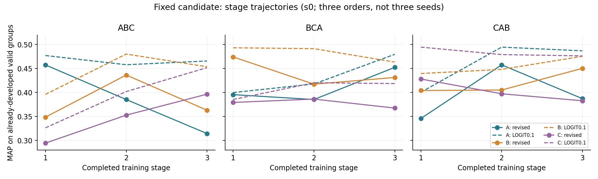

# 关系目标记忆修订固定点：结果与独立分析

2026-10-06，Asia/Shanghai。对象为20261006_135937的新B＋Q＋0.1R正式作业。完整结果已回传，Linux保存矩阵独立核验通过；本报告是主执行者分析，结果外审状态另见[submission](../reports/seller_alias_continual/20261006/relation_revision_result/review/submission.json)，尚不冒称外审／主审闭环。

## 1. 结论及适用范围

本次正常完成，现有来源、运行、访问和保存结果证据未显示使实验无效的缺陷；但效果是明确的配置级开发负结果。相对合同主要对手LOGIT0.1，O/N/Z的MAP和AP六项继续条件0/6，六个差值的条件95%区间全部小于零。比旧关系目标记忆固定点的对应均值也更低，尤其是最终旧域O；旧新版差只作历史描述，没有追加新比较区间或改变前瞻验收。

此次修订在计算上真实接入B与0.1R，并保持累计H/b/c/N和缓存迁移核心；但并未在这次固定配置上修复首域能力不足和旧域保持不足。实现准入通过证明可按定义执行，不保证效果提升。不得将失败改称实现未完成，也不得据此否定整个累计统计方法家族或声称已完成机制归因。

本轮合同到此不授权匹配重放、调系数、换种子、替换关系头或重训。LOGIT0.1继续是当前强基线；不恢复已关闭group-meta，不回退成用户否决的“LOGIT加约束”方案。保留核心是设计边界，不是创新性证明。

## 2. 实际运行、回传与独立核验

正式作业2026-10-06 14:05:45—17:55:53，exit0，13808秒（3小时50分8秒），剩余0。原估4—6小时，未触发24小时硬上限。19:03首次确认完成；本轮再次实查并回传。独立workspace为`/home/yongpeng/cross-lingual/reports/seller_alias_continual/20261006/relation_revision_execution/20261006_135937/workspace`，原进程已退出，没有新训练或重启。

| 核对对象 | 实际证据 |
|---|---|
| 正式更新 | ABC/BCA/CAB各三阶段×288，共2592；梯度群呈现4320 |
| 完整盲门 | 9端点，before_valid中train1、valid0、heldout/owners0 |
| 最终访问 | train1、valid1、heldout0、owners0；无failure.json |
| 保存结果 | 初始化1套＋9端点×3角色＝28套，60群×22列 |
| 来源 | 准入／execution／manifest／collected／evaluation对应31份冻结来源 |
| 校准／恢复 | 九次当前域校准收敛；正式记录包含完整model/Adam/RNG/Memory恢复和分数重放 |
| 显存allocated/reserved峰值 | 7.884 / 8.725GiB，reserved限28GiB |
| RSS／产物观察峰值 | 6.573 / 14.603GiB，分别限64 / 24GiB |
| 完整阶段末记忆 | 484442—504581字节，含六群及全部附属状态，限1MiB |
| 首次回传 | 168载荷，ZIP4763787字节，逐项大小／SHA一致 |
| 九权重 | Linux实查大小／SHA与端点一致，共11758415337字节；留存未删除、不下载、不载模 |

回传ZIP SHA256：`059c300be6db61892b6de5b364054396bf76800b1977af95b22a0f0f537a2175`。Memory本体留Linux，仅回传其身份描述；权重与Memory不进入外审。相同的观察显存不意味着固定最大形状原生探针没执行：原生手写448×256预算与正式实际文本长度不同，不能将正式耗时冒称公平加速贡献。

核验在既有Linux py310、CPU0、禁GPU执行：独立主体0.984秒，外层1.12秒，最大RSS66124KiB，exit0。复用原独立程序，只适配新端点名和新日志键，新增Q＋FP32字面0.1R日志组合核对；默认旧路径仍保留，旧回执源码不改。验证训练排列、历史抽样、Algorithm R、Adam连续步数、学习率、校准变换、28套矩阵、群／域／列配对，以及双方四角色七端点和主要差值，共1386个统计项（均值、三顺序、两区间端点共8316数值），绝对容差1e-12全部通过。新当前B三分量的浮点组合另外从保存日志核对。

诊断及画图另用保存结果，外层1.10秒、最大RSS74736KiB、exit0。两次都没有重新解析标签／正文、读取封存材料、训练、载模或新增GPU计算。MAP/AP来自既有群矩阵，未声称从真值重新计算这些指标。哈希与测试不是科学有效性的单独证明；已结合实际更新、Memory与评价调用链，以及原始接入外审范围判断。

直接材料位于[结果目录](../reports/seller_alias_continual/20261006/relation_revision_result/)：[inventory](../reports/seller_alias_continual/20261006/relation_revision_result/inventory.json)、[completion](../reports/seller_alias_continual/20261006/relation_revision_result/job/completion.json)、[独立核验](../reports/seller_alias_continual/20261006/relation_revision_result/verification/result.json)、[诊断](../reports/seller_alias_continual/20261006/relation_revision_result/analysis/diagnostics.json)。

## 3. 对LOGIT0.1的主要效果

O为最后两个旧域平均，N为后两阶段新域刚学完时平均，Z为最后最新域。差值＝修订候选−LOGIT0.1。MAP/AP越大越好。

| 指标 | 修订候选 | LOGIT0.1 | 差值 | 条件95%区间 |
|---|---:|---:|---:|---|
| O MAP | 0.374363 | 0.460800 | -0.086437 | [-0.098977,-0.073860] |
| N MAP | 0.429952 | 0.467031 | -0.037078 | [-0.049565,-0.024619] |
| Z MAP | 0.433101 | 0.468989 | -0.035888 | [-0.052762,-0.019803] |
| O AP | 0.205467 | 0.311544 | -0.106077 | [-0.119119,-0.092608] |
| N AP | 0.262685 | 0.314805 | -0.052120 | [-0.067045,-0.037599] |
| Z AP | 0.262482 | 0.320728 | -0.058247 | [-0.076326,-0.040847] |
| final_all MAP | 0.393942 | 0.463530 | -0.069588 | [-0.080885,-0.058419] |

三顺序的O MAP差分别ABC -0.120992、BCA -0.041627、CAB -0.096693；N和Z MAP也在三个顺序均为负。不是仅某一顺序拉低平均。相对旧版O/N/Z MAP的0.421179/0.439300/0.443666，修订后对应少0.046816/0.009347/0.010566；这不改变旧版自身的有效负结果。

Recall@5的O/N/Z为0.484970/0.544940/0.545238，对照差-0.103125/-0.059077/-0.068155，区间均低于零。MRR、NDCG等也见[七端点×22指标完整表](../reports/seller_alias_continual/20261006/relation_revision_result/analysis/metrics.zh.md)，包含三顺序差与区间；全raw/stage-cal/first-cal/primary角色保存在[evaluation.json](../reports/seller_alias_continual/20261006/relation_revision_result/job/evaluation/evaluation.json)。不能只报六项筛选。

概率预测同样退化。stage-cal的O/N/Z Brier为0.049139/0.045770/0.045741，比对照高0.005164/0.001927/0.002147；log-loss为0.197799/0.182489/0.182581，比对照高0.021088/0.007428/0.008577，六个差值区间均大于零。这里是校准后的概率预测误差，不等于单独校准误差或ECE；Brier/log-loss也受区分能力影响。

## 4. 首阶段问题未改善，后续遗忘更加突出

首阶段没有历史Q或R，因此这部分差距不能归因于历史迁移。

| 首阶段自身域MAP | 修订 | 旧版 | LOGIT共同首域 |
|---|---:|---:|---:|
| ABC/A | 0.457547 | 0.459008 | 0.477153 |
| BCA/B | 0.474226 | 0.483205 | 0.493308 |
| CAB/C | 0.428168 | 0.441489 | 0.494656 |

换成已知B目标没有使首域达到基线，三个描述性点值也没有高于旧版。新关系头、32维瓶颈、tanh和无Dropout仍区别于基线；不能从本次结果区分这些因素，也不能断言某一项必然有害。一次配置不支持“所有B目标都无效”。

| 自身首域MAP轨迹 | 修订：阶段1→2→3 | LOGIT0.1：阶段1→2→3 |
|---|---|---|
| ABC/A | 0.457547→0.385315→0.314347 | 0.477153→0.457921→0.465755 |
| BCA/B | 0.474226→0.417400→0.431364 | 0.493308→0.491393→0.463492 |
| CAB/C | 0.428168→0.397354→0.382737 | 0.494656→0.479123→0.476369 |

完整三域轨迹见下图。BCA/B在阶段3有局部回升，不能写成每一步都下降；但仍低于获取时及对照。旧版CAB/C最后改善的局部事实，也不能移到此次新配置。

修订F_first MAP＝0.077164，对照0.019834；额外遗忘+0.057331，条件区间[+0.038377,+0.076462]。两旧域平均F MAP＝0.065696，对照0.015922；差+0.049774，区间[+0.036366,+0.063052]。这次有明确的“比基线额外遗忘更多”证据，与旧版平均额外遗忘区间跨零的结论不同。

仍有正向局部学习：G MAP＝0.060477，对照0.058730，差+0.001747但区间[-0.010633,+0.013715]跨零。说明新域阶段内确有获得，不是完全没有学习；从较低起点获得一些能力，不能替代较低的绝对N/Z结果，也不能称G显著超过基线。

## 5. 新证据指向目标协调问题，但尚非因果消融

最关键的新线索在第二阶段第一步，即首次启用历史项。

| 顺序 | 新Q第一步 | 旧版历史平方项第一步 | 新Q阶段均值 | 新0.1R阶段均值 | 新裁剪前梯度范数中位数 |
|---|---:|---:|---:|---:|---:|
| ABC | 14.906948 | 1.976658 | 2.352113 | 0.054254 | 16.035 |
| BCA | 16.181284 | 2.046784 | 2.424517 | 0.037446 | 9.663 |
| CAB | 13.939096 | 1.556265 | 2.188902 | 0.044940 | 17.016 |

这个时间点很有区分力：首域先由B训练，阶段末积累的H/b/c/N却仍归约原来的“分数贴近±1＋正负差贴近2”的平方目标。第一次固化没有旧统计运输；第二阶段第一步的当前backward与历史backward之间也没有optimizer.step，尚未发生第二阶段更新引起的漂移。理想同表示Y=X时，v=(XXᵀ/378+εI)⁻¹(XXᵀw/378+εw)=w，Q就是首域累积平方代理。

因此，大Q并不能首先归咎于“经过许多次运输后误差累积”；它已经在初次历史介入时出现。这是当前B学到的状态与原Q目标不协调的直接诊断线索。随后三个顺序的Q末24步均值降至约2.034/2.051/1.829，而首域valid MAP均下滑；代理下降不等于旧域排序保持。这一联动支持优先审视目标兼容性，但没有测得分量梯度夹角或反事实轨迹，不能认定Q独自导致全部退化。

新增R确实以0.1进入历史总项，日志组合和原生路径已核验。表中加权R的标量值明显小于Q，但损失标量比例不能代替梯度比例；也不能由此直接推导“把0.1调大便能修好”。R只监督存活缓存，不覆盖淘汰群；它对共同分数平移不敏感，也不修复绝对概率。Q仍有正确大间隔回拉风险，此次没有把整个目标变成单侧保持。

后两阶段1728步全部裁剪前范数>1，阶段中位数9.66—25.71，说明统一clip全程活跃。旧版相应阶段也有较大范数，中位数16.17—23.85；不能说裁剪是新出现的故障或仅凭范数判梯度爆炸。统一缩放影响优化，Adam又使“缩放=同比缩小最终参数更新”的简化不成立；缺少分量梯度方向与更新归因，保留未决。

缓存实际构成为第三阶段ABC A4+B2、BCA B2+C4、CAB A6+C0，与旧版同一Algorithm R抽样流相同。CAB第三阶段无C原文，R不能直接给C群监督；但C的累计统计仍在N=96里，不能说所有C历史信息消失。ABC/BCA有两旧域缓存仍退化，故缺域不是唯一解释。新阶段2运输奇异值范围ABC约0.108—2.874、BCA 0.168—2.168、CAB 0.070—2.944，只是合法有限运输的各向异性诊断，不证明缓存外误差大小或唯一病因。

## 6. 固定0.5工作点出现明显漏检

下表由保存counts先求和再算比例，与群宏precision/F1不同；不附用群宏指标的区间。

| 端点／方法 | TP | FP | FN | TN | Precision | Recall | F1 |
|---|---:|---:|---:|---:|---:|---:|---:|
| O 修订 | 83 | 87 | 2317 | 42873 | 0.4882 | 0.0346 | 0.0646 |
| O LOGIT0.1 | 195 | 82 | 2205 | 42878 | 0.7040 | 0.0813 | 0.1457 |
| N 修订 | 22 | 18 | 2378 | 42942 | 0.5500 | 0.0092 | 0.0180 |
| N LOGIT0.1 | 180 | 78 | 2220 | 42882 | 0.6977 | 0.0750 | 0.1354 |
| Z 修订 | 22 | 18 | 1178 | 21462 | 0.5500 | 0.0183 | 0.0355 |
| Z LOGIT0.1 | 104 | 44 | 1096 | 21436 | 0.7027 | 0.0867 | 0.1543 |

第二阶段当前域的三个端点ABC/B、BCA/C、CAB/A各有400个正对，但TP=FP=0，全判负。ABC/CAB第二阶段全部60valid群也无预测正例，BCA全60群只检出两个，位于非当前域A/B。这里的阈值是校准logit≥0，即概率≥0.5，不是概率阈值0。

N/Z误报率下降与specificity提高是实际局部正向变化，但以大量漏检为代价。0.5工作点结果不佳不能直接写成MAP为零或模型输出恒定。正斜率校准保持排序，raw/stage-cal/first-cal的排序列一致，所以调校准阈值无法消除当前MAP/AP的排序差距；本轮也没有授权根据valid重新选阈值。

## 7. 结论边界与后续处置

这次确认的是：新公式在真实训练中执行了，但这套固定参数未达到预定效果；首域起点不足仍在，额外遗忘明显，概率工作点更加保守，Q在历史介入时暴露出目标协调风险。尚未证明哪一种头、B/Q/R梯度冲突或运输误差各贡献多少，也未证明累计信息具有独立创新价值。

区间是s0三个固定顺序、已开发valid的60实际群条件bootstrap，5000次PCG64、seed20260930；三顺序不是三训练种子。区间不覆盖重训随机性、开发选择或真实市场分布，不提供多指标同时覆盖。任务仍为中文合成28账号闭集候选排序和基础识别，不外推为真实市场、无正候选、大库检索或跨语言结论。

完成结果外审／主审收尾前保留九权重及必要Memory；旧九权重的清理授权不移用。完整保存有效负结果及局部正向事实，不按结果改判据、重跑或清理证据。本轮结果同步、Linux独立复算、网页审查和Windows Git交付分别在[sync](../reports/seller_alias_continual/20261006/relation_revision_result/sync.json)及审查记录报告。
